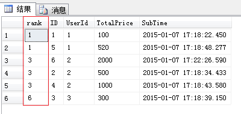

# NoSQL技术汇总

## Riak S3

- Riak S3很大程度上借鉴了Amazon Dynamo[Dynamo: Amazon’s Highly Available Key-value Store](https://docs.basho.com/riak/kv/2.2.3/learn/dynamo/)，这里[Riak vs. Cassandra – A Brief Comparison](http://basho.com/posts/technical/riak-vs-cassandra/)讲到了`Cassandra and Riak have architectural roots in Amazon’s Dynamo`。但是，Cassandra是宽表模型，即key/key/value存储，类似于hbase那样的列簇概念；而Riak是纯粹的key/value存储。
- Riak KV使用一致性哈希来分区和分布数据；
- Riak KV使用向量钟来解决对象版本问题，这里对向量钟有一个有助于理解的例子：[Why Vector Clocks are Easy](http://basho.com/posts/technical/why-vector-clocks-are-easy/)，这里又讲了该实现方式实际背后的一些困难：[Why Vector Clocks Are Hard](http://basho.com/posts/technical/why-vector-clocks-are-hard/)
- Riak KV使用Gossip协议来和其他节点交流哈希环状态和成员信息。

这篇文章介绍了一起时钟问题引起的故障，延伸阅读到有关向量钟等文章：[Clocks Are Bad, Or, Welcome to the Wonderful World of Distributed Systems](http://basho.com/posts/technical/clocks-are-bad-or-welcome-to-distributed-systems/)

Riak KV的一些基本概念：[Riak KV Glossary ](http://docs.basho.com/riak/kv/2.2.3/learn/glossary/)

Riak KV的冲突解决策略留待以后细看：[Conflict Resolution](https://docs.basho.com/riak/kv/2.2.3/developing/usage/conflict-resolution/)

Riak KV里对于一致性哈希的使用：[https://docs.basho.com/riak/kv/2.2.3/learn/concepts/clusters/](https://docs.basho.com/riak/kv/2.2.3/learn/concepts/clusters/)


## HBase

## Redis

Redis的KEYS命令会阻塞服务器，相关功能要使用SCAN来实现 - 见[Redis latency problems troubleshooting](https://redis.io/topics/latency)

## MySQL

#### MyISAM v.s. InnoDB

1. MyISAM只有表锁，该锁类似于一个读写锁，读可以并发，但是读写要串行；InnoDB除了表锁还有行锁。

   InnoDB行锁是通过索引上的索引项来实现的，意味着：只有通过索引条件检索数据，InnoDB才会使用行级锁，否则，InnoDB将使用表锁！

   另外，InnoDB是否把行锁升级为表锁，和索引属性重复率有一定的关系：当“值重复率”低时，甚至接近主键或者唯一索引的效果，“普通索引”依然是行锁；当“值重复率”高时，MySQL 不会把这个“普通索引”当做索引，即造成了一个没有索引的 SQL，此时引发表锁。[MySQL 避免行锁升级为表锁——使用高效的索引](https://juejin.im/post/58f04e6b61ff4b0058e33d77)

2. InnoDB支持事务，MyISAM没有；

3. InnoDB是聚集索引，数据文件和索引绑在一起，必有有主键，而且主键效率高，二级索引则需要两次查询；MyISAM是非聚集索引，索引和数据文件分离，索引保存的是数据文件的指针，主键索引和二级索引是独立的；（见后面的图）

4. InnoDB不保存表行数，select count(*) from table需要扫全表；而MyISAM保存了的；

5. Innodb不支持全文索引，而MyISAM支持全文索引，查询效率上MyISAM要高。 


## SqlServer

#### 窗口函数使用例子

[department-top-three-salaries](https://leetcode.com/problems/department-top-three-salaries/)

```mssql
select Department, Employee, Salary from
(
    select t.Department, t.Employee, t.Salary, dense_rank() over (partition by t.Department order by t.Salary desc) as rk
    from (
        select e.Id Eid, e.Name Employee, e.Salary, d.Name Department, d.Id Did
        from Employee e, Department d
        where e.DepartmentId = d.Id
    ) t
) n
where n.rk <= 3
```

1. row_number() -> 为查询出来的每一行记录生成一个序号，依次排序且不会重复；

   

2. rank() -> 考虑到了over子句中排序字段值相同的情况，如果使用rank函数来生成序号，over子句中排序字段值相同的序号是一样的，后面的记录可能和前面的的rank()值有gap；

   

3. dense_rank() -> 与rank函数类似，dense_rank函数在生成序号时是连续的，无gap。

   