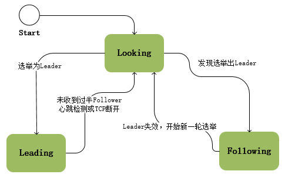

# ZooKeeper笔记要点

## 来源汇总：

- [浅析Zookeeper的一致性原理](https://zhuanlan.zhihu.com/p/25594630) 
- [Zookeeper与Paxos](https://www.jianshu.com/p/8bf3b7ce3eaa)
- [Zookeeper的Leader选举](http://www.cnblogs.com/leesf456/p/6107600.html)
- [Raft协议详解](https://zhuanlan.zhihu.com/p/27207160)
- [raft算法与paxos算法相比有什么优势，使用场景有什么差异？](https://www.zhihu.com/question/36648084)

## 内容摘抄

- 对于每个事务请求，zk都会为其分配一个全局唯一的事务ID，即ZXID，是一个64位的数字，高32位表示该事务发生的集群选举周期（集群每发生一次leader选举，值加1），低32位表示该事务在当前选择周期内的递增次序（leader每处理一个事务请求，值加1，发生一次leader选择，低32位要清0）。

- 数据快照用来记录zk服务器上某一时刻的全量内存数据内容，并将其写入到指定的磁盘文件中。

- leader广播一个事务消息后，当收到半数以上的ack信息时，就认为集群中所有节点都收到了消息，然后leader就不需要再等待剩余节点的ack，直接广播commit消息，提交事务。

- zk的集群伸缩不是很灵活，集群中所有机器ip及port都是事先配置在每个服务的zoo.cfg 文件里的。如果要往集群增加一个follower节点，首先需要更改所有机器的zoo.cfg，然后逐个重启。

- 集群模式下，单个zk服务节点启动时的工作流程大体如下：

  - 统一由QuorumPeerMain作为启动类，加载解析zoo.cfg配置文件；
  - 初始化核心类：ServerCnxnFactory（IO操作）、FileTxnSnapLog（事务日志及快照文件操作）、QuorumPeer实例（代表zk集群中的一台机器）、ZKDatabase（内存数据库）等；
  - 加载本地快照文件及事务日志，恢复内存数据；
  - 完成leader选举，节点间通过一系列投票，选举产生最合适的机器成为leader，同时其余机器成为follower或是observer。关于选举算法，就是集群中哪个机器处理的数据越新（通过ZXID来比较，ZXID越大，数据越新），其越有可能被选中；
  - 完成leader与learner间的数据同步：集群中节点角色确定后，leader会重新加载本地快照及日志文件，以此作为基准数据，再结合各个learner的本地提交数据，leader再确定需要给具体learner回滚哪些数据及同步哪些数据；
  - 当leader收到过半的learner完成数据同步的ACK，集群开始正常工作，可以接收并处理客户端请求，在此之前集群不可用。

- 节点的3种状态之一：Looking/Following/Leading

  

- ZooKeeper并不是直接使用了Paxos，只是与Paxos的一些理念比较接近。它有自己的leader选举方式和一致性算法ZAB。具体过程先记录在这里：[实例详解ZooKeeper ZAB协议、分布式锁与领导选举](https://dbaplus.cn/news-141-1875-1.html)，[Zookeeper  Zab协议](https://blog.csdn.net/lu1005287365/article/details/52678400)

## 对Paxos的理解

我看Paxos协议主要是基于这两篇文章：

- [微信PaxosStore：深入浅出Paxos算法协议](http://www.infoq.com/cn/articles/wechat-paxosstore-paxos-algorithm-protocol)
- [如何浅显易懂地解说 Paxos 的算法？](https://www.zhihu.com/question/19787937/answer/107750652)这个故事里用贿赂的方式来形容该协议，对理解有帮助

**Paxos最终要解决什么问题？**

我认为Paxos最重要的一点是，保证在一轮算法运行后，各节点会收敛到同一个值。在一个分布式系统中，各个节点有可能在不同时间点propose不同的值，而Paxos保证了这些不同的proposal不会一直持续下去，很快大家就能达成共识（实现一致性）。

在Paxos协议实现中，要达到这一点，最重要的一点就是：当一个节点收到prepare请求后，会返回之前accepted的值当中，编号最大的那个；而发起prepare请求的proposer节点，如果发现已经有节点accepted其他proposal了，会从这些返回中，挑选出编号最大的那个proposal的值；如果没有的话才会使用自己想要propose的值。

这意味着什么呢？参与Paxos协议的各个节点，更努力地使系统的值快速收敛，实现一致性，哪怕这是其他节点之前的proposal，而不是去一味推销自己的proposal。

把上面的贿赂例子稍微改一下：

1. 假设有一群人（2N+1个）在讨论去哪里旅游。
2. 玄慈正用100元贿赂部分人去嵩山，并且已经有萧峰接受了该提议。
3. 随后张三丰想去光明顶，并告诉其他人，自己准备用200元去贿赂他们（如果只用50元，那些被100元贿赂过的人根本不鸟他）。
4. 这时萧峰会同意张三丰来贿赂他，同时告诉他：我之前接受过玄慈100元的贿赂，答应了去嵩山。
5. 张三丰的200元还是挺多的，有不少于N+1个人回复他说同意他的贿赂，其中包括萧峰；
6. 张三丰看到同意贿赂的是多数派，就真的把红包发出去了；这里的关键是，张三丰注意到萧峰已经答应了玄慈去嵩山，所以他在红包里放弃了之前考虑的去光明顶的提议，写的目的地是嵩山。这是Paxos协议很关键的一点，其参与者（如张三丰）尽管是想向其他参与者推销自己属意的目的地光明顶，但是一旦发现别人已经提议和接受了其他目的地，就立刻向其他人靠拢（而且把嵩山“加价”到了200），而不是仗着自己贿赂的钱多再弄出一个新的目的地，逼大家接受。这些参与者追求的是“赶快找个目的地定下来，如果你们已经答应好去哪我就附议”，而不是非要去自己要去的地方，否则这个讨论过程就没完没了了，而且一直会有分歧。

在一个2N+1的Paxos系统中，一旦有节点a针对proposal（假设值为v）拿到N+1个accepted，别的节点b就不可能再拿到N+1个针对v'（v'!=v）的accepted了，因为此N+1和彼N+1一定有至少1个共同节点，而该节点会告诉b，我当初accepted了一个v值，从而阻止b提出v'这个提议。

## Raft v.s. Paxos

- Paxos有2个问题，导致没有被实际使用：1）第一版的论文太晦涩；2）工程实现上有困难。Raft进行了改进，论文更清晰，易于工程实现；性能有所提升。但是核心思想还是借鉴了Paxos来保证：被多数派所接受的决议无法被推翻，基于反证法来保证这一点 - 两个多数派至少有一个交集节点，该节点不会使系统里有2个决议在运行。
- Raft强化了leader的地位，将协议分为leader选举和leader在时怎么处理两个部分，并引入了日志连续性来简化实现。