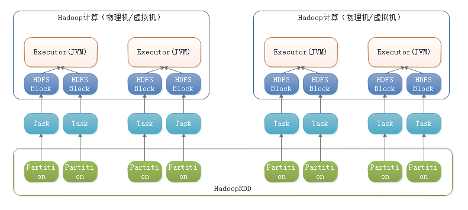
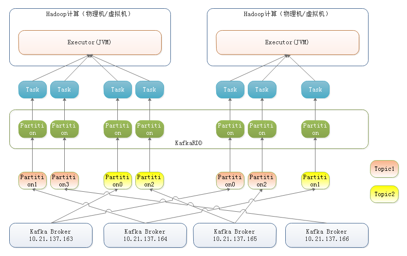
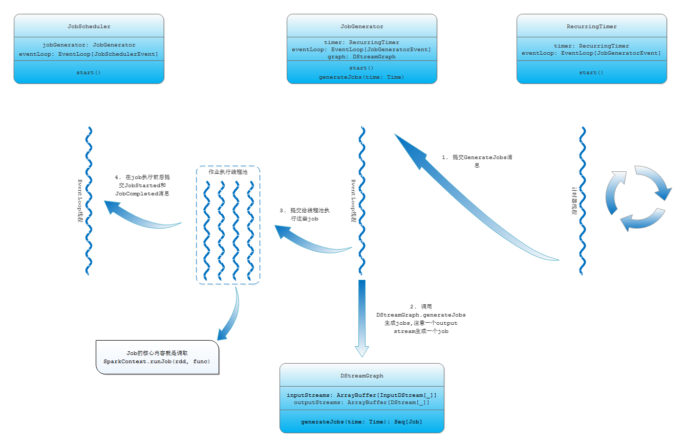
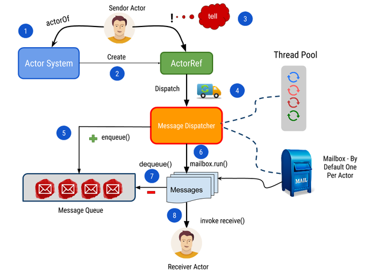

# Spark学习笔记

------

## 常见操作

### 运行一个Spark example（本地模式，基于2.3.0）

`mayaming@ubuntu:/bigdata/spark-2.3.0-bin-hadoop2.6/bin$./spark-submit --class org.apache.spark.examples.SparkPi --master local[8] ../examples/jars/spark-examples_2.11-2.3.0.jar 100`

### 运行一个Spark example（yarn cluster模式，基于2.3.0）

`mayaming@ubuntu:/bigdata/spark-2.3.0-bin-hadoop2.6/bin$./spark-submit --class org.apache.spark.examples.SparkPi --master yarn --deploy-mode cluster ../examples/jars/spark-examples_2.11-2.3.0.jar 100`

#### 几个曾经遇到的错误

这里很可能碰到这样一个错误：

> 2018-08-09 15:19:52 WARN  DomainSocketFactory:117 - The short-circuit local reads feature cannot be used because libhadoop cannot be loaded.
> Exception in thread "main" java.lang.NoClassDefFoundError: com/sun/jersey/api/client/config/ClientConfig
> ......
> Caused by: java.lang.ClassNotFoundException: com.sun.jersey.api.client.config.ClientConfig
> 	at java.net.URLClassLoader.findClass(URLClassLoader.java:381)
> 	at java.lang.ClassLoader.loadClass(ClassLoader.java:424)
> 	at sun.misc.Launcher$AppClassLoader.loadClass(Launcher.java:349)
> 	at java.lang.ClassLoader.loadClass(ClassLoader.java:357)
> 	... 24 more

对该问题的修复可以看[Spark版本升级二三事](https://www.jianshu.com/p/d630582c8108)。

这里我还曾经碰到yarn里launch container失败，报bad substitution的问题，解决方法参考["bad substitution" error running Spark on Yarn](https://community.hortonworks.com/questions/23699/bad-substitution-error-running-spark-on-yarn.html)，需要为yarn-site.xml添加hdp.version参数。

### 加速spark distribution文件分发

来自[Running Spark on YARN](https://spark.apache.org/docs/latest/running-on-yarn.html#preparations)

> Running Spark on YARN requires a binary distribution of Spark which is built with YARN support. Binary distributions can be downloaded from the downloads page of the project website. To build Spark yourself, refer to Building Spark.
>
> To make Spark runtime jars accessible from YARN side, you can specify spark.yarn.archive or spark.yarn.jars. For details please refer to Spark Properties. If neither spark.yarn.archive nor spark.yarn.jars is specified, Spark will create a zip file with all jars under $SPARK_HOME/jars and upload it to the distributed cache.

制作这个distribution archive的过程可以见[`spark.yarn.jar`和`spark.yarn.archive`的使用](https://www.jianshu.com/p/016fbd2a421b)，这样就不用在启动spark任务的时候再打包$SPARK_HOME下的jars并上传了，形如这样的日志：

> 14:44:08.859 [spark-app-1: '...leClusterExample'] WARN  org.apache.spark.deploy.yarn.Client - Neither spark.yarn.jars nor spark.yarn.archive is set, falling back to uploading libraries under SPARK_HOME.
> 14:44:10.324 [spark-app-1: '...leClusterExample'] INFO  org.apache.spark.deploy.yarn.Client - Uploading resource file:/tmp/spark-516a445e-146b-42c8-8cad-51ba678b420f/__spark_libs__5293937850255976251.zip -> hdfs://hadoop-archive-cluster/user/hdfs/.sparkStaging/application_1533958922434_0005/__spark_libs__5293937850255976251.zip

## 学习笔记

### RDD概念

1. RDD只是Driver上一个Java对象，存储了该RDD的metadata。

2. RDD有个compute方法，该方法很关键，每个RDD实现类需要实现该方法，返回对实际数据的一个iterator。

   ```scala
     @DeveloperApi
     def compute(split: Partition, context: TaskContext): Iterator[T]
   ```

3. RDD的partition/task/executor映射关系图：

   

4. Spark Streaming对接Kafka时的RDD映射关系图：

   

### 运作流程

#### Spark RDD action提交流程

- 考虑一下，如下代码执行时发生了什么？

  ```scala
      val lines = spark.sparkContext.textFile(fp)
      println(s"${new Date}: There're ${lines.count()} lines for $fp")
  ```

- 首先，textFile会创建一个`HadoopRDD`，key是改行在文件中的位置，value是行的文本内容，并进行一次map transformation，转换函数是从tuple里抽取第2个元素转化为string（实际就是抽取行文本内容）。所以这里进行了一次`RDD[(LongWritable, Text)]`到`RDD[String]`的转换。

  ```scala
      hadoopFile(path, classOf[TextInputFormat], classOf[LongWritable], classOf[Text],
        minPartitions).map(pair => pair._2.toString).setName(path)
  ```

- 然后，`RDD[String].count()`是一个action，跑的是

  ```scala
  sc.runJob(this, Utils.getIteratorSize _).sum
  ```

  这段会针对该RDD的每一个结果partition，跑`Utils.getIteratorSize`方法得到该partition记录数，然后算总和，注意算总和是在driver上进行的。

- 接下来跑到这一段：

  ```scala
    def runJob[T, U: ClassTag](
        rdd: RDD[T],
        func: (TaskContext, Iterator[T]) => U,
        partitions: Seq[Int],
        resultHandler: (Int, U) => Unit): Unit = {
      ...
      dagScheduler.runJob(rdd, cleanedFunc, partitions, callSite, resultHandler, localProperties.get)
      ...
    }
  ```

  `DAGScheduler`有一个`EventLoop[DAGSchedulerEvent]`，这里向该event loop提交了`JobSubmitted`消息，异步地执行到`DAGScheduler.handleJobSubmitted`方法，并根据RDD的依赖关系创建了一个个stage，且stage之间也会有依赖关系。

#### Spark任务提交流程（partition怎么映射到executor上）

- `DAGScheduler.submitMissingTasks`里面会调用`TaskScheduler.submitTasks`，通常实现是`TaskSchedulerImpl`
- `TaskSchedulerImpl.submitTasks`调用`SchedulerBackend.reviveOffers`，以`CoarseGrainedSchedulerBackend`为例，它的`reviveOffers`方法会向driver发送`ReviveOffers`消息，通过`RpcEndpointRef`实例，比如driver对应的实例
- 该`ReviveOffers`消息又会被这个`CoarseGrainedSchedulerBackend`异步地收到，调用`makeOffers`方法，再调到`TaskSchedulerImpl.resourceOffers`方法
- `TaskSchedulerImpl.resourceOffers`方法会遍历所有的TaskSet，针对每一个TaskSet，会循环调用`TaskSchedulerImpl.resourceOfferSingleTaskSet`，后者为每一个活着的executor（已shuffle过）分配一个任务。分配的时候会考虑到locality preference，如果没有的话，就是类似于一个round robin的实现

#### Spark Streaming运作流程（结合DirectKafkaInputDStream）

- 首先创建一个DStream：

  ```scala
  val stream = KafkaUtils.createDirectStream[String, String](ssc, PreferConsistent, Subscribe[String, String](topics, kafkaParams))
  ```

  这里把该DStream*注册*给了该StreamingContext

- 然后在该DStream上*注册*各种操作逻辑：

  ```scala
  stream.foreachRDD((rdd, ts) => {
      println(s"now to deal with batch ${ts.toString}")
      rdd.foreach(r => {
          AssignMap.put(TaskContext.getPartitionId, r.topic, r.partition)
      })
  })
  ```

- 然后调用StreamingContext的start方法：

  - 首先检查该StreamingContext是不是INITIALIZED状态，是的话执行初始化操作

  - 初始化的过程会创建一个新的线程，在线程里调用`JobScheduler.start()`方法，该方法又会创建一个JobScheduler的event loop线程，该event loop接收JobSchedulerEvent事件

  - 每个JobScheduler还会有一个JobGenerator实例，调用该实例的`JobGenerator.start()`方法，该方法又会创建一个JobGenerator的event loop线程，该event loop接收JobGeneratorEvent事件；JobGenerator最终会调取到`RecurringTimer.start()`方法，该方法定期执行构建RecurringTimer时传入的callback方法。对于JobGenerator来说，传入的callback是：

    ```scala
    longTime => eventLoop.post(GenerateJobs(new Time(longTime)))
    ```

    即，定期向JobGenerator的event loop里提交GenerateJobs消息，参数当该timer的时间。注意一次timer触发会导致提交多个job，每个job对应一个output stream。

    详情可见：

    

### Spark中的RPC

在Spark代码中我们经常可能看到如下3个概念：

```scala
abstract class RpcEnv(conf: SparkConf) 
abstract class RpcEndpointRef(conf: SparkConf)
trait RpcEndpoint
```

这些概念是学自Akka Actor的，类似于Actor System，ActorRef和Actor。

在Akka中，Actor System是整体的入口；Actor是一个个交互实体；但是从一个Actor向另一个Actor发送消息时，并不是直接发送给目标Actor，而是创建一个“代理”，即ActorRef，通过调用带“代理”上的方法，向目标Actor发送数据。通过ActorRef来屏蔽该Actor具体在网络中什么位置。下图可以作为一个参考：



## 一些问题

1. HDFS是按照block去split文件的，有些RDD需要以行为单位分割文本文件，会不会有1行分到多个block里，怎么处理的？

   答案见[Hadoop MapReduce中如何处理跨行Block和InputSplit](https://my.oschina.net/xiangchen/blog/99653)

   有关InputSplit和底层HDFS block的一个不错的解释：[Hadoop input split size vs block size](https://stackoverflow.com/questions/17727468/hadoop-input-split-size-vs-block-size)

   相关的一些知识点：

   - Block是HDFS存储文件的单位（默认是64M）
   - InputSplit是MapReduce对文件进行处理和运算的输入单位，只是一个逻辑概念，每个InputSplit并没有对文件实际的切割，只是记录了要处理的数据的位置（包括文件的path和hosts）和长度（由start和length决定），InputSplit也是一个接口
   - InputFormat将一个输入（比如文件）分成多个InputSplit，还提供了`getRecordReader`方法，给定一个InputSplit，返回一个RecordReader<K, V>
   - RecordReader提供了`next(K key, V value)`方法来遍历并获得某一个InputSplit的具体数据

1. spark-submit命令是怎么自动找到hadoop的各种配置（那些yarn-site.xml等文件），加到命令行参数的？

   该命令并不直接生成要调的命令行，跳来跳去最终会执行

   ```bash
   "$RUNNER" -Xmx128m -cp "$LAUNCH_CLASSPATH" org.apache.spark.launcher.Main "$@"
   ```

   这个`org.apache.spark.launcher.Main`用来生成命令行参数，兜兜转转会走到AbstractCommandBuilder类，里面有如下一段代码

   ```java
       addToClassPath(cp, getenv("HADOOP_CONF_DIR"));
       addToClassPath(cp, getenv("YARN_CONF_DIR"));
       addToClassPath(cp, getenv("SPARK_DIST_CLASSPATH"));
   ```

   这样就找到了配置信息了，**只要你指定了HADOOP_CONF_DIR环境变量**。

   如果你是用其他launch方法，就要自己想办法把这些配置信息加到classpath里了。

   


