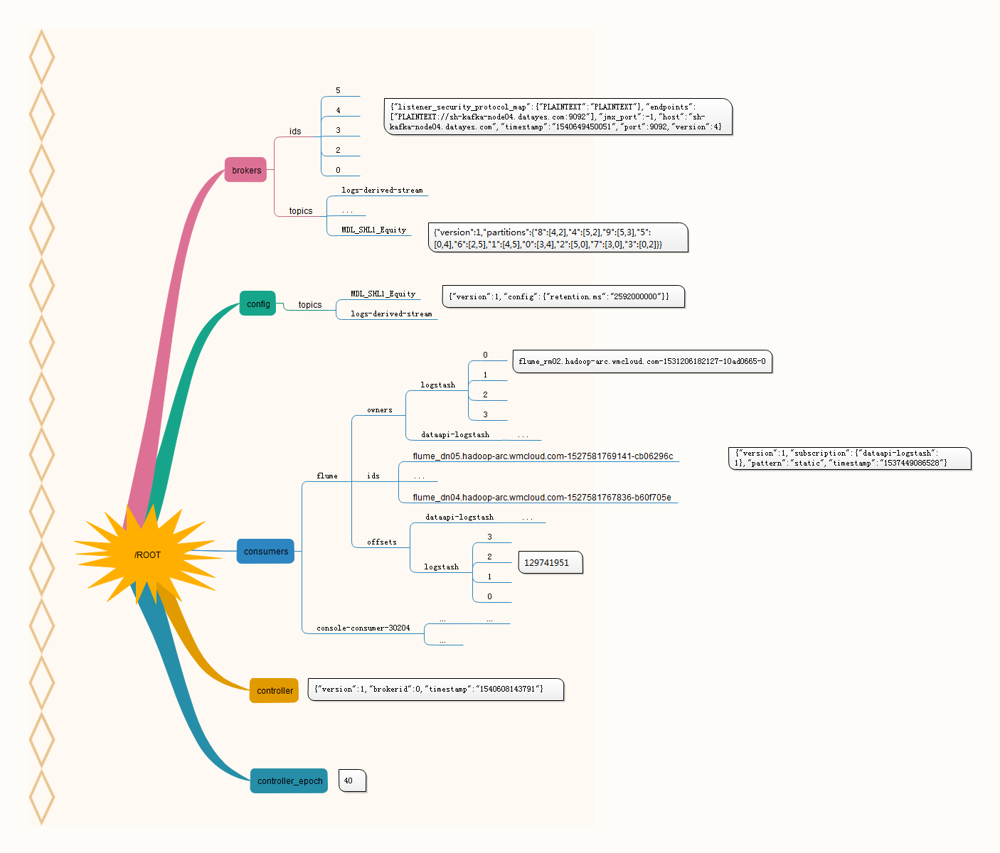
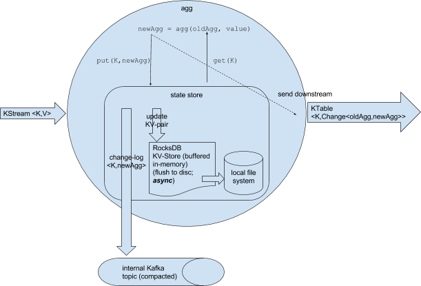

# bash

#### Shell下重复多次执行命令

https://zhuanlan.zhihu.com/p/28023094

```bash
$ watch -n 1 date
```

```bash
while true; do date; sleep 1; done
```

```bash
seq 10 | xargs -i date
# 注意这里的-i的作用
```


#### ps aux输出详解

`ps aux`

| USER  | PID   | %CPU | %MEM | VSZ   | RSS  | TTY  | STAT | START | TIME | COMMAND                                                      |
| :---- | :---- | :--- | :--- | :---- | :--- | :--- | :--- | :---- | :--- | :----------------------------------------------------------- |
| ppipe | 31723 | 0.0  | 0.0  | 17960 | 1528 | ?    | S    | May20 | 0:03 | rsync -avzL 218.244.142.25::output_25 /datayes/pipeline/newsCrawler/data_25/ |
stat 中的参数意义如下：
   - D 不可中断 Uninterruptible（usually IO）
   - R 正在运行，或在队列中的进程
   - S 处于休眠状态
   - T 停止或被追踪
   - Z 僵尸进程
   - W 进入内存交换（从内核2.6开始无效）
   - X   死掉的进程

< 高优先级 
n   低优先级
s   包含子进程
\+   位于后台的进程组


# 数据结构与算法

[云风实现的伙伴内存分配算法](https://github.com/cloudwu/buddy)

[一篇关于跳表的不错总结](http://zhangtielei.com/posts/blog-redis-skiplist.html)以及[一个简单的跳表实现](https://github.com/begeekmyfriend/skiplist/blob/master/skiplist.h)
[Paxos小结](http://drmingdrmer.github.io/post-res/paxos-slide/pdf/paxos.html)

golang里的字符串匹配算法：[golang 字符匹配算法研究一](https://www.jianshu.com/p/a21fb880798d)，用滚动hash来计算子串hash值，进行相等性测试的方法很巧妙。

# Java

### 语言自身

[Java中以零拷贝的方式在不同的file descriptor之间传输数据](https://www.ibm.com/developerworks/linux/library/j-zerocopy/)

**wait/notify v.s. park/unpark**：unpark可以在park之前调，不会有那种notify在wait之前调用，导致一直在等待；指定唤醒某一个线程，而不是像notify一样随机挑一个；park/unpark模型真正解耦了线程之间的同步，线程之间不再需要一个Object或者其它变量来存储状态，不再需要关心对方的状态。[Java的LockSupport.park()实现分析](https://blog.csdn.net/hengyunabc/article/details/28126139)

#### java.util.concurrent

并发相关的包里都有什么组件？

java.util.concurrent

- atom包 -> 各种原子类，如AtomicInteger

                                     + locks包 -> 各种锁相关，如LockSupport，ReadWriteLock，ReentrantLock
                                     + 线程池相关类，如ExecutorService，ThreadPoolExecutor，ForkJoinPool
                                     + 线程安全集合类，如ConcurrentHashMap，LinkedBlockingQueue
                                     + 其他辅助类，如Semaphore，CountDownLatch，Future等

#### 线程状态


注意这里的阻塞/等待队列/锁池其实都是一种阻塞状态。

### Spring

在pom.xml里同时包括了spring boot和spring cloud的包，但是不想启动spring cloud相关组件（比如当前并不需要使用consul相关功能）：

JVM参数加上`-Dspring.cloud.bootstrap.enabled=false`

想知道Spring Boot提供了哪些AutoConfiguration?[Appendix A. Common application properties](https://docs.spring.io/spring-boot/docs/2.0.3.RELEASE/reference/htmlsingle/#common-application-properties)

# Kafka

[这里列举了Kafka分区及复制一些有用的命令](https://cwiki.apache.org/confluence/display/KAFKA/Replication+tools#Replicationtools-5.AddPartitionTool)

[ZooKeeper在Kafka中的作用](https://www.quora.com/What-is-the-need-of-zookeeper-in-Apache-kafka)



### Kafka Stream

Kafka Stream能做哪些不能做哪些，这里有个很好的例子：[Why Kafka Streams didn't work for us](https://aseigneurin.github.io/2017/08/04/why-kafka-streams-didnt-work-for-us-part-1.html)。主要的原因还是Kafka Stream是根据消息的key来做aggregation的；如果要根据某个字段（比如isValid）来做，就要生成新的消息，以isValid的值（0/1）作为key，写到另一个topic里面。而Kafka Stream的并行度是根据partition来的，这里只有2个partition有值且data skew可能很严重，所以后续处理起来不够优化。我觉得Kafka Stream主要还是适合于纯粹的横向扩展型任务，有点类似于Python Celery的使用场景，不涉及到类似Spark的shuffle操作，因为它没有shuffle的能力。

[Kafka Stream examples](https://github.com/confluentinc/kafka-streams-examples)

Kafka Stream运行KTable.to方法的时候，明明提供了key和value的Serde，仍然报Serializer不匹配：

```java
ticks.map((key, value) -> new KeyValue<>(key + "-" + value.getClass().getSimpleName() + "-" + new SimpleDateFormat("[yyyy-MM-dd HH:mm]").format(value.getDate()), value))
  .groupByKey()
  .count("ticks-count")
  .to(Serdes.String(), Serdes.Long(), "ticks-count");
```

> Caused by: org.apache.kafka.streams.errors.StreamsException: A serializer (key: org.apache.kafka.common.serialization.ByteArraySerializer / value: org.apache.kafka.common.serialization.ByteArraySerializer) is not compatible to the actual key or value type (key type: java.lang.String / value type: com.github.mayaming.demo_collection.java_example.kafka.bean.MDLSHL2Snapshot). Change the default Serdes in StreamConfig or provide correct Serdes via method parameters.

原因：尽管最后的结果stream提供了正确的Serde，但是中间的map/groupByKey操作导致了一次repartition（类似于Spark的shuffle），从而需要生成一个中间topic tick-count-ticks-count-repartition，把中间数据（map那一步生成的）写入到该topic里。最后的KStream.to方法里指定的Serde对此不适用，会使用之前配的全局的Serde，因而有可能会发生无法序列化的问题。解决方法是使用KStream.groupByKey(final Serde<K> keySerde, final Serde<V> valSerde)方法。

总之，在Kafka Stream里做shuffle的话要深思。

#### Kafka Stream聚合操作的内部数据管理

官方的解释可以看这里：[Kafka Streams Internal Data Management](https://cwiki.apache.org/confluence/display/KAFKA/Kafka+Streams+Internal+Data+Management)

这里是一段代码示例：

```java
        ticks.groupByKey(stringSerde, MDLAvroSerde).aggregate(
                MinuteCache::new,
                (k, v, cache) -> {
                    cache.addTick(v.getDate());
                    return cache;
                },
                minuteCacheSerde,
                "minute-store"
        );
```

1. ticks的类型是`KStream<String, MDLBase>`，其中String表示ticker如600396，MDLBase是tick数据的基类；
2. groupBy的结果是`KGroupedStream<K, V>`，即`KGroupedStream<String, MDLBase>`；
3. 每次新来一条tick数据会调用`Aggregator<? super K, ? super V, VR>`来聚合数据，生成新结果MinuteCache；
4. 新的`<String, MinuteCache>`会被存储到state store里供查询，这里是用一个RocksDB来存储的，该DB的内容会被定期flush到本地文件系统（比如我这里是在`/tmp/kafka-streams/tick-count/0_0/rocksdb/minute-store`目录下，这里你可以看到命名规则）；
5. 同时该`<String, MinuteCache>`内容会被发到Kafka的tick-count-minute-store-changelog topic，用于重启/crash等以后的恢复。该topic的cleanup.policy是compact。
6. **注意**：当因为某种原因Kafka Stream重启后，有可能会读取本地文件系统，之前flush的state store内容恢复过来。如果这过程中你修改过groupBy...agg的逻辑，比如这里把MinuteCache换成其他什么内容，可能反序列化出来内容就不正确了。当你换了机器，肯定是要从change-log topic来恢复的；但是没有换的情况下，本地缓存的RocksDB文件和change-log topic怎么协调，用谁不用谁，还需要细致调查。



> For **KTable** a similar behavior applies. Using groupBy().someAgg() results in **internal topic** and **RocksDB** creation.
>
> For **stateful** KStream transformation (transform, transformValue, and process) an **explicit state store** is used. Depending on the use state store, a changelog topic might get created.
>
> For **joins**, one or two internal **state stores (RocksDB plus internal changelog topic)** are used. Behavior is same as for aggregates. Joins can also be windowed (see window aggregates).

# 存储技术

[CephFS基本技术介绍(PPT)](https://www.slideshare.net/YangGuanjun/cephfs)

[Ceph介绍及原理架构分享](https://www.jianshu.com/p/cc3ece850433)

# 数据库理论

第一/二/三范式简介：[数据库（第一范式，第二范式，第三范式）](https://blog.csdn.net/Dream_angel_Z/article/details/45175621)

- 一：单列原子不可再拆分；
- 二：必须有主键且非主键列必须完全依赖主键，而不是其中的一部分，如 UnitPrice，ProductName 只依赖于 ProductID，不应该存在于OrderDetail表中；
- 三：消除对主键的传递依赖，如CustomerName，CustomerAddr，CustomerCity 直接依赖的是 CustomerID（非主键列），而不是直接依赖于主键，它是通过传递才依赖于主键，所以不符合 3NF。

