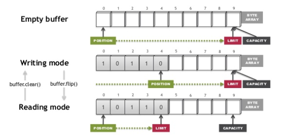
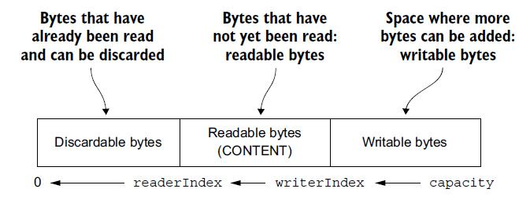
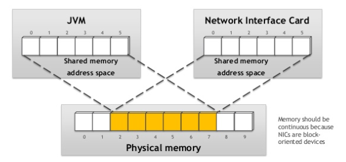
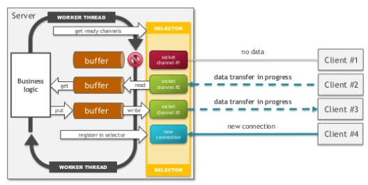
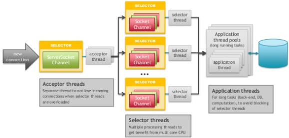
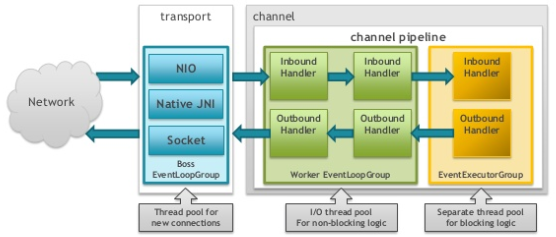
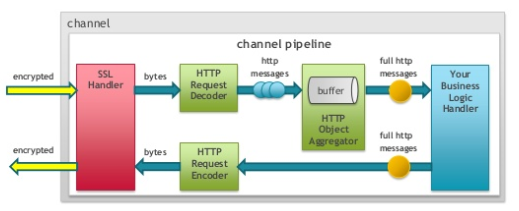

# Netty学习笔记


## [Networking in Java with NIO and Netty](https://www.slideshare.net/kslisenko/networking-in-java-with-nio-and-netty-76583794)解读

这里列出的是一个比较好的讲Netty的slide，读一圈下来基本上就可以理解Netty的大体架构了。

### NIO里的buffer

下面这幅图形象得解释了NIO里用的ByteBuffer是怎样读写复用的：



要点：

- 通过Buffer.allocate()方法分配缓冲区，如`ByteBuffer buf = ByteBuffer.allocate(28);`；
- 既可以通过channel读写，也可以手动读写如：

```java
int bytesRead = inChannel.read(buf); //read into buffer.
buf.put(127);
int bytesWritten = inChannel.write(buf);
byte aByte = buf.get();
```

- 通过flip()实现写->读；通过clear()（有些还有compact()）实现读->写模式。


### Netty中的ByteBuf

- ByteBuffer中复用position为读写指针，netty中为readIndex/writeIndex，避免了ByteBuffer中读写模式切换的繁琐；

  

- 可动态扩展；

- 引用计数与池化技术，供以后申请时复用。

### 看懂Direct Buffer



为了达到零拷贝的效果，除了文件使用transferTo()方法外，Java还提供了direct buffer（堆外），见上图解释。

### NIO server 架构







